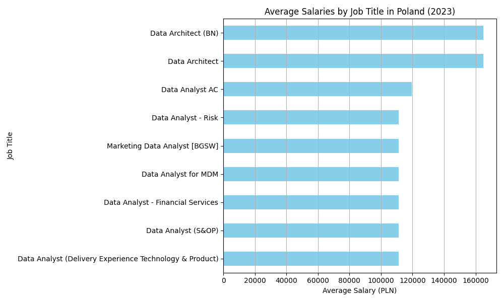
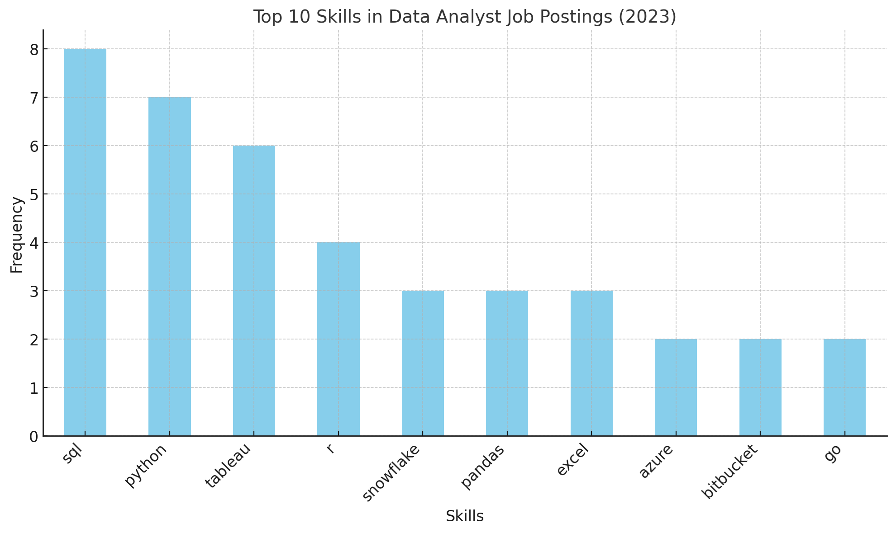

# Introduction
📊 Dive into the data job market! Focusing on data analyst roles, this project explores 💰 top-paying jobs, 🔥 in-demand skills, and 📈 where high demand meets high salary in data analytics.

🔍 SQL queries? Check them out here: [project_sql folder](/project_sql/)

# Background

Driven by a quest to navigate the data analyst job market more effectively, this project was born from a desire to pinpoint top-paid and in-demand skills, streamlining others work to find optimal jobs.

Data hails from my [SQL Course](https://lukebarousse.com/sql). It's packed with insights on job titles, salaries, locations, and essential skills.

### The questions I wanted to answer through my SQL queries were:
1. What are the top-paying data analyst jobs?
2. What skills are required for these top-paying jobs?
3. What skills are most in demand for data analysts?
4. Which skills are associated with higher salaries?
5. What are the most optimal skills to learn?

# Tools I Used
For my deep dive into the data analyst job market, I harnessed the power of several key tools:

- **SQL:** The backbone of my analysis, allowing me to query the database and unearth critical insights.
- **PostgreSQL:** The chosen database management system, ideal for handling the job posting data.
- **Visual Studio Code:** My go-to for database management and executing SQL queries.
- **Git & GitHub:** Essential for version control and sharing my SQL scripts and analysis, ensuring collaboration and project tracking.

# The Analysis

Each query for this project aimed at investigating specific aspects of the data analyst job market. Here’s how I approached each question:

### 1. Top Paying Data Analyst Jobs
To identify the highest-paying roles, I filtered data analyst positions by average yearly salary and location, focusing on remote jobs. This query highlights the high paying opportunities in the field.

```sql
SELECT 
    job_id,
    name AS company_name,
    job_title,
    job_location,
    salary_year_avg,
    job_posted_date
FROM job_postings_fact
LEFT JOIN company_dim 
ON job_postings_fact.company_id = company_dim.company_id

WHERE 
    job_country = 'Poland' AND 
    salary_year_avg IS NOT NULL AND 
    job_title_short = 'Data Analyst'
ORDER BY salary_year_avg DESC
LIMIT 10
```
### Here's the breakdown of the top data analyst jobs in 2023:

- **Salary Distribution:** The salaries for these data analyst roles range from $111,175.0 to $165,000.0 annually.

- **Diverse Industry Representation:** Data analysts are in demand across multiple industries like energy, finance, advertising, and logistics.

- **Job Title Variety:** There's a high diversity in job titles, from Data Analyst to Data Architect, reflecting varied roles and specializations within data analytics.



### 2. Skills for Top Paying Jobs
To understand what skills are required for the top-paying jobs, I joined the job postings with the skills data, providing insights into what employers value for high-compensation roles.
```sql
WITH top_paying_jobs AS(
    SELECT 
        job_id,
        name AS company_name,
        job_title,
        salary_year_avg
    FROM job_postings_fact
    LEFT JOIN company_dim 
    ON job_postings_fact.company_id = company_dim.company_id

    WHERE 
        job_work_from_home = 'True' AND 
        salary_year_avg IS NOT NULL AND 
        job_title_short = 'Data Analyst'
    ORDER BY salary_year_avg DESC
    LIMIT 10
)
SELECT 
    top_paying_jobs.*,
    skills
FROM top_paying_jobs
INNER JOIN skills_job_dim
ON top_paying_jobs.job_id = skills_job_dim.job_id
INNER JOIN skills_dim
ON skills_job_dim.skill_id = skills_dim.skill_id
```
Here's the breakdown of the most demanded skills for the top 10 highest paying data analyst jobs in 2023:

- SQL is leading with a bold count of 8.
- Python follows closely with a bold count of 7.
- Tableau is also highly sought after, with a bold count of 6. 
- Other skills like R, Snowflake, Pandas, and Excel show varying degrees of demand.

### 3. In-Demand Skills for Data Analysts
This query helped identify the skills most frequently requested in job postings, directing focus to areas with high demand.
```sql
SELECT 
    skills,
    COUNT(skills_job_dim.job_id) AS demand_count
FROM job_postings_fact
INNER JOIN skills_job_dim ON job_postings_fact.job_id = skills_job_dim.job_id
INNER JOIN skills_dim ON skills_job_dim.skill_id = skills_dim.skill_id
WHERE 
    job_title_short = 'Data Analyst' AND 
    job_country = 'Poland'
GROUP BY skills
ORDER BY demand_count DESC
LIMIT 5
```

- **SQL** and **Excel** remain fundamental, emphasizing the need for strong foundational skills in data processing and spreadsheet manipulation.
- **Programming** and **Visualization Tools** like **Python**, **Tableau**, and **Power BI** are essential, pointing towards the increasing importance of technical skills in data storytelling and decision support.

| Skills    | Demand Count |
|-----------|--------------|
| SQL       | 1581         |
| Excel     | 1186         |
| Python    | 950          |
| Tableau   | 692          |
| Power BI  | 644          |

### 4. Skills Based on Salary
Exploring the average salaries associated with different skills revealed which skills are the highest paying.

```sql
SELECT
    skills,
    ROUND(AVG(salary_year_avg), 2) AS average_salary
FROM job_postings_fact
INNER JOIN skills_job_dim ON job_postings_fact.job_id = skills_job_dim.job_id
INNER JOIN skills_dim ON skills_job_dim.skill_id = skills_dim.skill_id
WHERE 
    job_title_short = 'Data Analyst' AND 
    salary_year_avg IS NOT NULL AND
    job_country = 'Poland'
GROUP BY skills
ORDER BY average_salary DESC
LIMIT 25
```
| Skills    | Average Salary ($) |
|-----------|----------------------|
| Mongo     | 165,000.00           |
| Linux     | 165,000.00           |
| AWS       | 165,000.00           |
| Hadoop    | 133,750.00           |
| NoSQL     | 131,750.00           |
| SAS       | 111,175.00           |
| BigQuery  | 111,175.00           |
| Jira      | 111,175.00           |
| Qlik      | 111,175.00           |
| Snowflake | 111,175.00           |

Here's a breakdown of the results for top paying skills for Data Analysts:
- **Cloud & Big Data:** High-paying skills include AWS, Linux, MongoDB, and Hadoop, with salaries up to 165,000 PLN.
- **Data Platforms & Visualization:** Tools like **Snowflake**, **BigQuery**, **Tableau**, and **Qlik** offer strong compensation, reflecting the demand for managing and visualizing large datasets.
- **Programming Languages:** Languages such as **Python**, **SQL**, and **C++** are essential but pay slightly less than specialized tools and platforms.
### 5.Most Optimal Skills to Learn
Combining insights from demand and salary data, this query aimed to pinpoint skills that are both in high demand and have high salaries, offering a strategic focus for skill development.

```sql
WITH skills_demand AS(
    SELECT 
        skills_dim.skill_id,
        skills_dim.skills,
        COUNT(skills_job_dim.job_id) AS demand_count
    FROM job_postings_fact
    INNER JOIN skills_job_dim ON job_postings_fact.job_id = skills_job_dim.job_id
    INNER JOIN skills_dim ON skills_job_dim.skill_id = skills_dim.skill_id
    WHERE 
        job_title_short = 'Data Analyst' AND 
        salary_year_avg IS NOT NULL AND
        job_country = 'Poland'
    GROUP BY skills_dim.skill_id
), average_salary AS(
    SELECT
        skills_job_dim.skill_id,
        ROUND(AVG(salary_year_avg), 2) AS average_salary
    FROM job_postings_fact
    INNER JOIN skills_job_dim ON job_postings_fact.job_id = skills_job_dim.job_id
    INNER JOIN skills_dim ON skills_job_dim.skill_id = skills_dim.skill_id
    WHERE 
        job_title_short = 'Data Analyst' AND 
        salary_year_avg IS NOT NULL AND
        job_country = 'Poland'
    GROUP BY skills_job_dim.skill_id
)

SELECT 
    skills_demand.skill_id,
    skills_demand.skills,
    demand_count,
    average_salary
FROM
    skills_demand
INNER JOIN average_salary ON skills_demand.skill_id = average_salary.skill_id
ORDER BY 
    average_salary DESC,
    demand_count DESC
```
| Skill ID | Skills    | Demand Count | Average Salary (PLN) |
|----------|-----------|--------------|----------------------|
| 0        | SQL       | 26           | 91,421.60            |
| 181      | Excel     | 16           | 73,799.72            |
| 1        | Python    | 15           | 94,220.33            |
| 182      | Tableau   | 13           | 105,407.85           |
| 81       | GCP       | 10           | 89,697.05            |
| 92       | Spark     | 8            | 107,250.00           |
| 183      | Power BI  | 8            | 84,468.75            |
| 185      | Looker    | 6            | 103,711.25           |
| 170      | Windows   | 5            | 109,440.00           |
| 96       | Airflow   | 5            | 109,440.00           |


Here's a breakdown of the most optimal skills for Data Analysts in 2023:

- **High Demand for Core Analytical Skills:** SQL is by far the most in-demand skill with 26 job postings, followed by Excel (16) and Python (15). This shows that these foundational skills are essential for data analyst roles.

- **Visualization and BI Tools Are Crucial:** Tools like Tableau (13 postings) and Power BI (8 postings) are highly sought after, indicating that data visualization and business intelligence capabilities are key for employers.

- **Cloud and Big Data Knowledge Adds Value:** GCP (10 postings), Spark (8 postings), and Airflow (5 postings) show the growing importance of cloud platforms and big data tools, highlighting the trend towards data scalability and advanced analytics.

# What I Learned

During this analysis I learned beginner and intermediate SQL topics such like:
- **Complex Query Crafting,**
- **Data Aggregation,**
- **Subqueries,**
- **JOINs.**

# Conclusions
### Insights
From the analysis, several general insights emerged:

1. **Top-Paying Data Analyst Jobs:** The highest-paying jobs for data analysts in Poland offer a wide range of salaries, the highest at $165,000!
2. **Skills for Top-Paying Jobs:** High-paying data analyst jobs require advanced proficiency in SQL, suggesting it’s a critical skill for earning a top salary.
3. **Most In-Demand Skills:** SQL is also the most demanded skill in the data analyst job market, thus making it essential for job seekers.
4. **Skills with Higher Salaries:** Specialized skills, such as Jira and Hadoop, are associated with the highest average salaries, indicating a premium on niche expertise.
5. **Optimal Skills for Job Market Value:** SQL leads in demand and offers for a high average salary, positioning it as one of the most optimal skills for data analysts to learn to maximize their market value.